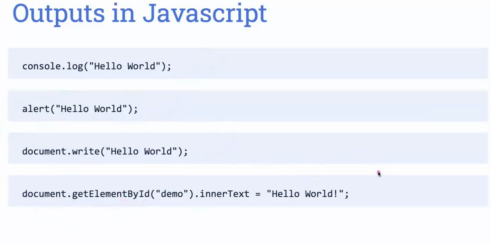

⁸# javaScriptingTopics
Basic on about Inputs, var, let, cont, stringManiplication, mathematicalFunctions 

| No.| Questions                                                                                                                                                                   |
| ---| ----------------------------------------------------------------------------------------------------------------------------------------------------------------------------------------------------------------------------------------------------------------------|
|    | **Basic-concepts**                                                                                                                                                          |                                                                                                                                                                    
| 1  | [What-are-output-statements](#)                                                                                                                                             |
| 2  | [Why-we-use-var-let-const](#)                                                                                                                                               |
| 3  | [string-Maniplications](#)                                                                                                                                                  |
| 4  | [Mathematical-functions](#)                                                                                                                                                |

| 1  | [What-are-output-statements](#) 

| 2  | [Why-we-use-var-let-const](#)

1.var: Var is the Variable , which always located at left andceach VAR has Data types.

2.Let: Key can be used wticevas your logic isage and it can have more data tupes using LET.

3.const: Const can be used only once in the declaration and we can not change, when we use Const deceleration.

                                                                                                                                                                                  
                                                                                                                                                                                  
  
